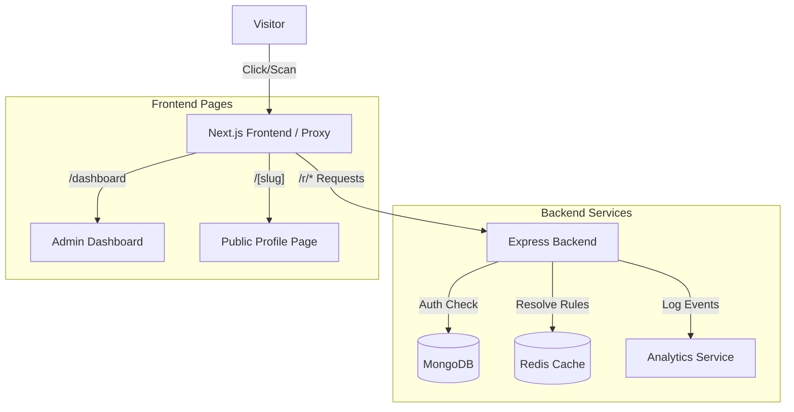

# 📘 Smart Link Hub - Comprehensive Technical Report

> **Project:** Smart Link Hub / Linktree Clone with Smart Routing
> **Version:** 1.0.0
> **Date:** January 27, 2026

---

## 1. Executive Summary

**Smart Link Hub** is a sophisticated, enterprise-grade link management platform designed to supersede traditional bio-link tools. While standard tools offer static lists of links, Smart Link Hub introduces **"Context-Aware Routing"**. This allow creators, marketers, and developers to serve different content to different users based on their device, location, and time of access, all through a single URL.

This report details the technical architecture, feature set, code structure, and implementation strategies used to build this Monorepo application.

---

## 2. Solution Overview

### The Problem
In a fragmented digital landscape, a single "link in bio" is often insufficient.
*   **Device Fragmentation:** Sending an iPhone user to the Google Play Store results in a bounce.
*   **Geo-Blocking:** Sending a user in India to a US-only storefront leads to frustration.
*   **Static Content:** Links cannot adapt to time-sensitive campaigns (e.g., "Flash Sale" links appearing only during sale hours).

### The Solution
**Smart Link Hub** solves this by inserting an intelligent **Decision Engine** between the click and the destination.

*   **Single Entry Point:** One short URL (e.g., `localhost:3000/r/xyz`) or QR code.
*   **Real-time Analysis:** The backend analyzes the request's User-Agent, IP address (GeoIP), and Timestamp.
*   **Dynamic Decision Tree:** A flexible rule engine traverses a tree of conditions (e.g., `IF Country=US AND Device=iOS THEN Target=Link A`).
*   **Instant Redirection:** The user is seamlessly proxied to the most relevant destination.

---

## 3. Technical Architecture

The project follows a modern **Monorepo** architecture, ensuring code cohesion and simplified dependency management.

### 3.1 Stack Breakdown

| Component | Technology | Rationale |
| :--- | :--- | :--- |
| **Frontend** | **Next.js 15+ (App Router)** | Server-Side Rendering (SSR) for SEO-friendly profiles; fast transitions; TypeScript integration. |
| **Backend** | **Node.js + Express** | High-performance, event-driven architecture suitable for handling thousands of concurrent redirects. |
| **Database** | **MongoDB** | Schema-less design perfect for storing variable Rule Trees and hierarchical configurations. |
| **Cache** | **Redis** | Critical for sub-millisecond Rule Tree retrieval during the redirection phase. |
| **Styling** | **Tailwind CSS v4** | Rapid UI development with a consistent, customizable design system. |
| **Auth** | **JWT (JSON Web Tokens)** | Stateless authentication for scalable API interactions. |

### 3.2 System Diagram



---

## 4. Comprehensive Feature Analysis

### 4.1 🧠 Smart Routing Engine
*   **Mechanism:** Implements a recursive Decision Tree traversal algorithm.
*   **Nodes:** The tree consists of "Decision Nodes" (conditions) and "Result Nodes" (variants).
*   **Caching:** Rule trees are cached in Redis with a TTL (Time-To-Live). When a user updates a Hub, the cache is instantly invalidated to ensure immediate consistency.

### 4.2 🔗 Edit Hub Functionality (New Feature)
We implemented a robust editing suite allowing users to modify critical Hub parameters without recreating them.
*   **Modal Interface:** A sleek `EditHubModal` provides a user-friendly form to update the **Hub Slug** and **Default URL**.
*   **Real-time Validation:** Prevents duplicate slugs and invalid URL formats.
*   **Backend Integration:** Connects to `PUT /api/admin/hubs/:hub_id`, updating the MongoDB document and ensuring data integrity.

### 4.3 📱 Advanced QR Code System
Moved away from unreliable external APIs to a robust internal generation system.
*   **Local Generation:** Uses the `qrcode` Node.js/Browser library. This ensures privacy (data never leaves the client) and reliability (works offline).
*   **Smart Profile Redirect:** The QR code encodes a Short URL (`/r/:code`). Our updated logic redirects this Short URL **directly to the Hub Profile Page** (`/my-hub`), rather than a specific destination. This effectively turns the QR code into a "digital business card" that always points to the user's latest curation of links.
*   **Vector & Raster:** Users can download high-resolution **PNG** (for web) or **SVG** (for print/billboards) formats.

### 4.4 📊 Deep Analytics
*   **Event Logging:** Every click, scan, and redirect is logged with rich metadata (IP, Location, Device, Referrer).
*   **Visualizations:** The dashboard renders this data into:
    *   **Trends:** Line charts showing traffic spikes.
    *   **Geographic Distribution:** Interactive maps highlighting top countries.
    *   **Performance:** Click-Through Rate (CTR) calculation for every link variant.

---

## 5. Code Structure & Documentation

The codebase is organized for scalability and readability.

### 5.1 Project Root
```
/
├── apps/
│   ├── frontend/         # Next.js Application
│   └── backend/          # Express API Server
├── package.json          # Workspace configuration
└── REPORT.md             # This file
```

### 5.2 Key Backend Modules
*   **`apps/backend/src/routes/shorturl.ts`**: The heart of the redirection logic.
    *   *Function:* Handles `GET /r/:code`.
    *   *Logic:* Looks up Hub -> Logs Event -> Redirects to `/${hub.slug}`.
*   **`apps/backend/src/services/DecisionTreeEngine.ts`**: Contains the logic to evaluate user requests against rules.
*   **`apps/backend/src/models/LinkHub.ts`**: Mongoose schema definition, including the Base62 Short Code generator.

### 5.3 Key Frontend Components
*   **`apps/frontend/src/app/dashboard/page.tsx`**: The main command center. Orchestrates fetching data, rendering the Hub list, and managing modals.
*   **`apps/frontend/src/components/EditHubModal.tsx`**: The newly added component for modifying Hub settings.
*   **`apps/frontend/src/lib/api-client.ts`**: A centralized, type-safe wrapper around `fetch` for all API interactions.

---

## 6. Screenshots & Visuals

*(Note: These are placeholders as screenshots could not be automatically captured)*

### 1. The Dashboard Overview

*The central hub where users manage their links, view quick stats, and access tools.*

### 2. Edit Hub Interface

*The modal interface allowing users to change their public slug and fallback URL.*

### 3. QR Code Generator

*The tools page showing the custom QR code generator with color options.*

---

## 7. Future Roadmap

To further enhance Smart Link Hub, we propose the following features:
1.  **A/B Testing:** Automatically split traffic between two variants to see which performs better.
2.  **Custom Domains:** Allow users to connect their own domains (e.g., `link.mybrand.com`).
3.  **Team Collaboration:** Granular permissions for multiple users to manage a single Hub.
4.  **Pixel Integration:** Add Facebook/Google Pixels for retargeting audiences.

---

## 8. Conclusion

Smart Link Hub represents a significant leap forward from basic link shorteners. By combining a flexible routing engine with a modern, performant tech stack, we have created a platform that is not just a utility, but a powerful marketing tool. The code is modular, type-safe, and ready for further scaling.
